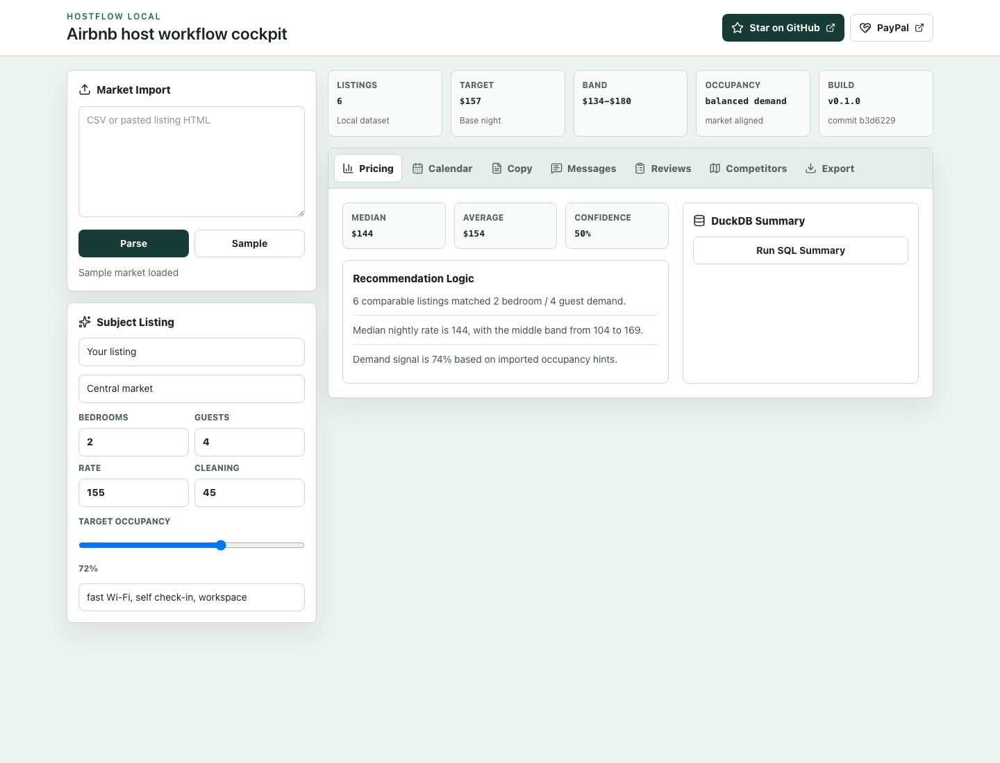
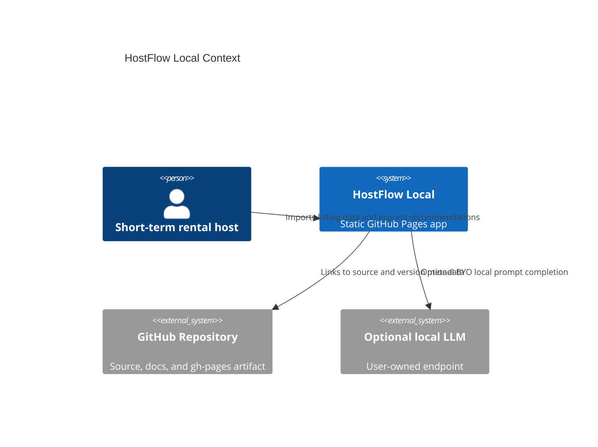

# HostFlow Local

[](https://baditaflorin.github.io/hostflow-local/)
[](LICENSE)

Local-first toolkit for short-term rental hosts to analyze pricing, optimize calendars, and draft guest-ready content.



Live site: https://baditaflorin.github.io/hostflow-local/

Repository: https://github.com/baditaflorin/hostflow-local

Support: https://www.paypal.com/paypalme/florinbadita

## Quickstart

```bash
npm install
make dev
make test
make build
make pages-preview
```

## Architecture

HostFlow Local is a Mode A GitHub Pages app. The browser owns import parsing, pricing analysis, calendar recommendations, draft generation, and local persistence. Optional local LLM calls use a user-supplied endpoint; no secrets are bundled or stored by the project.

## What v0.2.0 includes

- Paste, upload, drag-drop, clipboard, URL, and workspace-JSON import paths for host data.
- Pricing band, occupancy signal, and 30-day calendar recommendations.
- Listing copy, guest templates, review responses, competitor ranking, and one-click copy actions.
- Markdown, CSV, JSON, workspace-save, print, and share-link export paths.
- Lazy DuckDB-WASM neighborhood summary, optional local LLM polish through a user-owned endpoint, and version/commit metadata visible in the live UI.

## Workspace flow

- Upload a CSV, paste HTML, drop files, or read from the clipboard.
- Review import intelligence before committing the market set.
- Save the full workspace as JSON or copy a small share link.
- Export the final report as Markdown, CSV, JSON, or browser-print output.



ADRs start at `docs/adr/0001-deployment-mode.md`.
