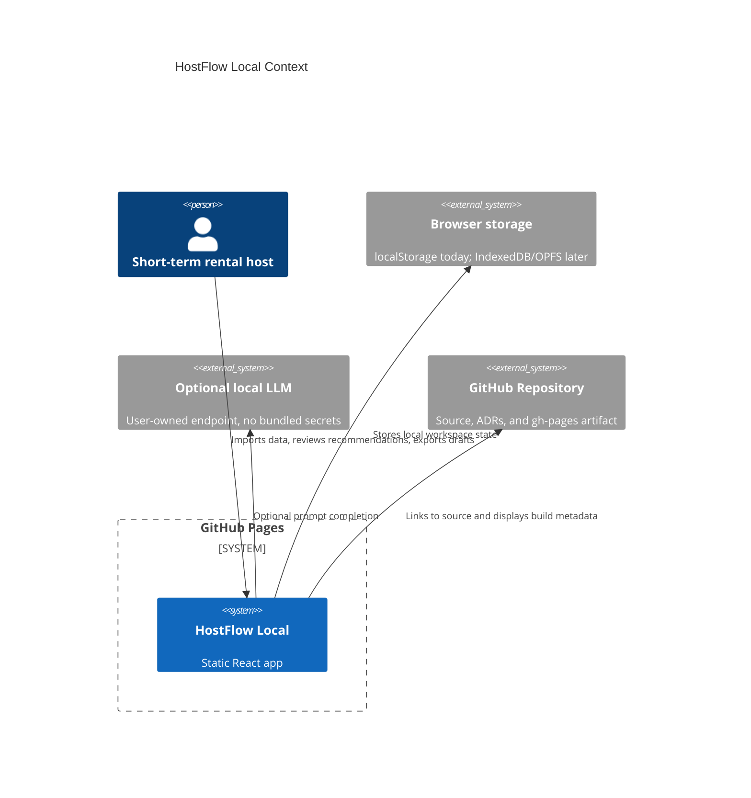
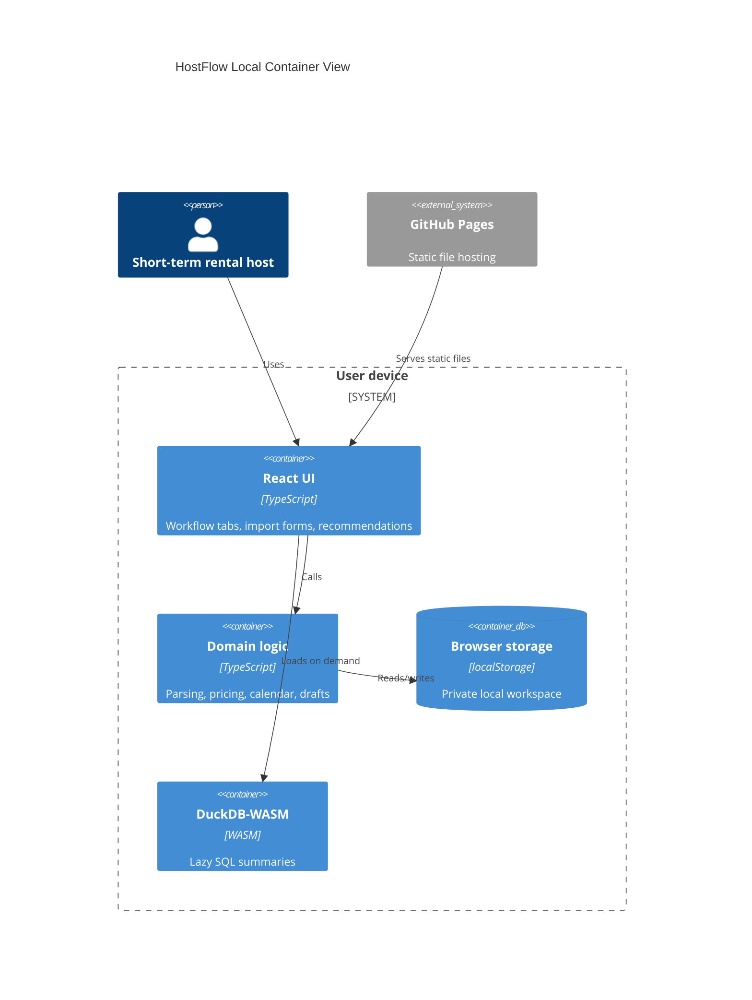

# Architecture

HostFlow Local is a Mode A GitHub Pages application.

Live site: https://baditaflorin.github.io/hostflow-local/

Repository: https://github.com/baditaflorin/hostflow-local

## Context

## Container

